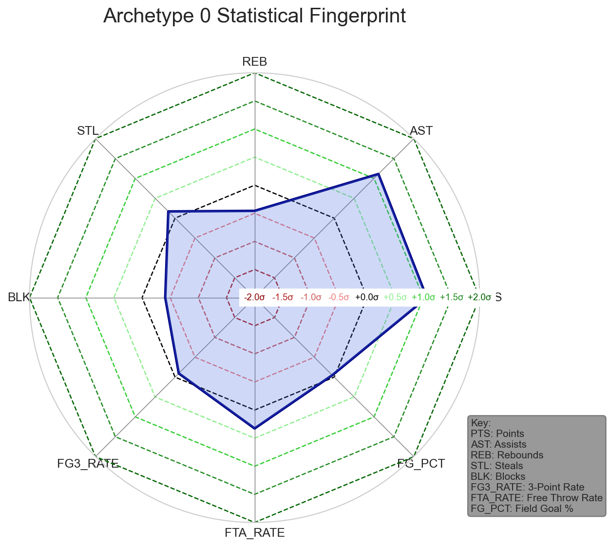
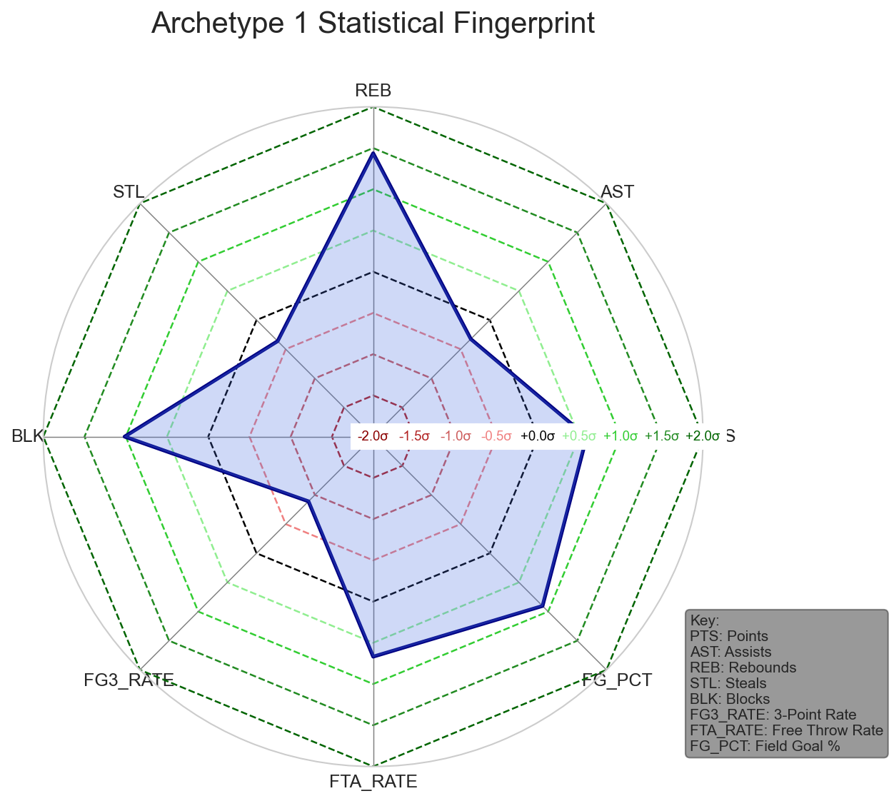
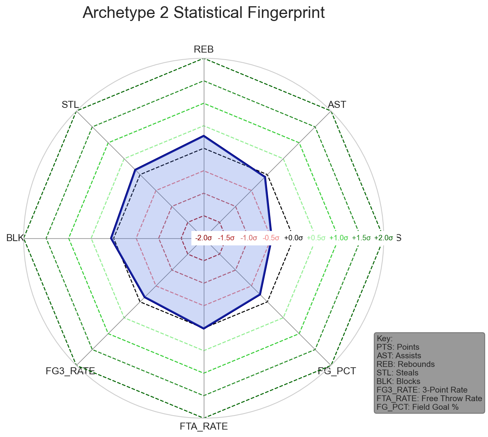
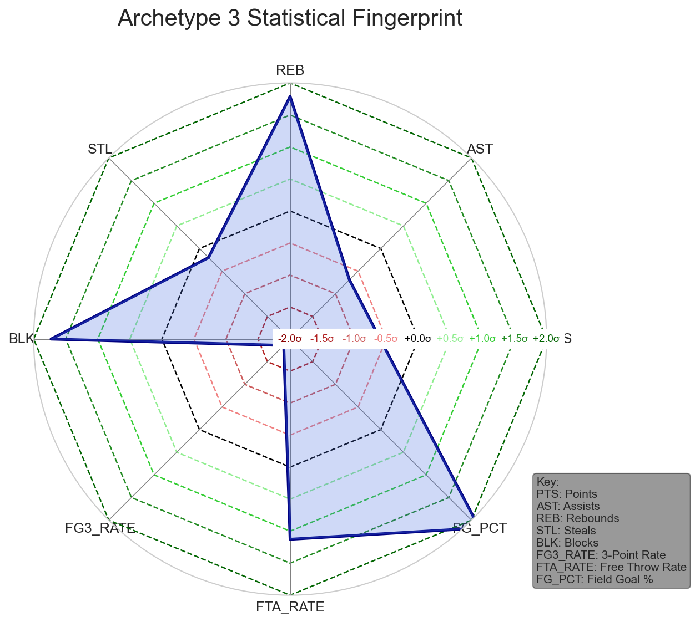
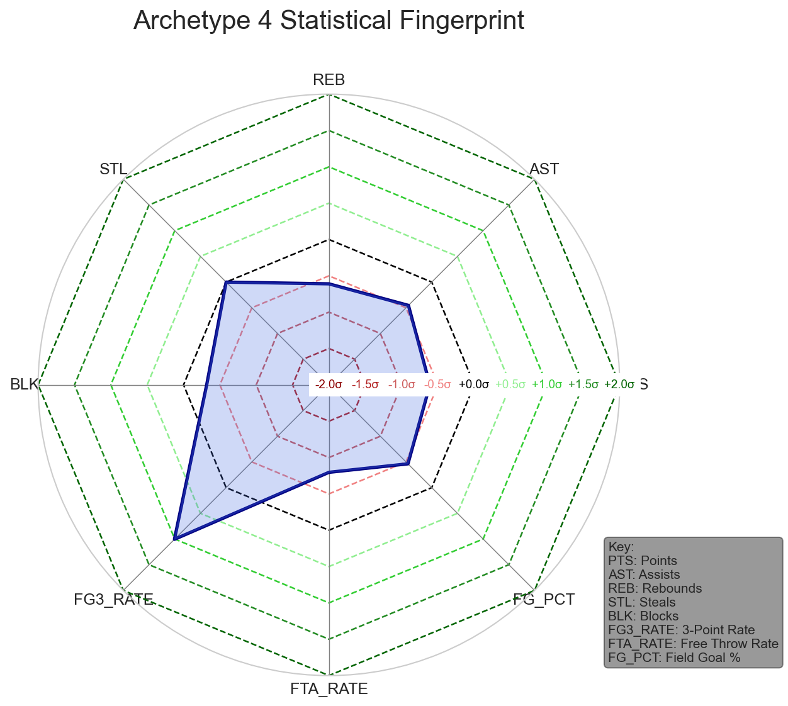
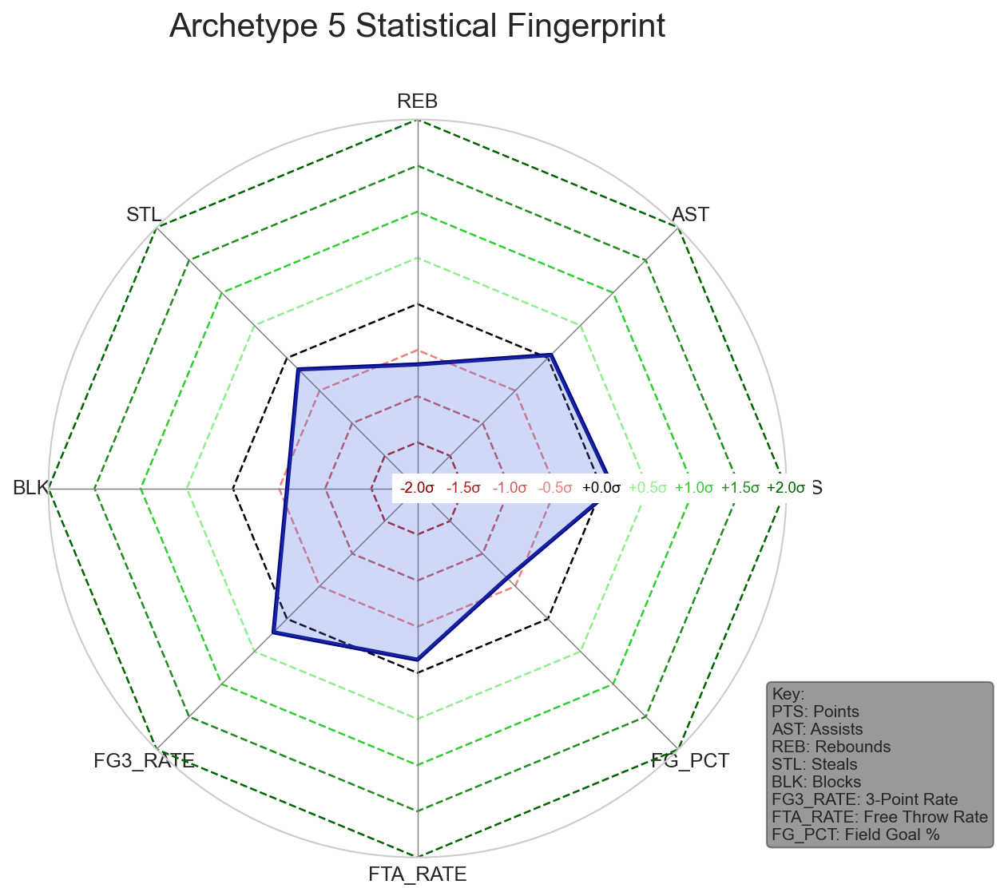

# 🏀 NBA Player Archetypes: A Machine Learning Analysis

## Project Goal
To move beyond traditional player positions (Guard, Forward, Center) and use unsupervised machine learning to identify the true, data-driven archetypes of modern NBA players. This analysis serves as a strategic tool for team-building, scouting, and identifying undervalued assets in the league.

---

## Methodology
1.  **Data Collection**: Player statistics for the 2022-23 and 2023-24 seasons were collected using the `nba_api` package. A two-pass approach was used: "Totals" data was used to reliably filter players with significant playing time (>= 800 minutes), while "Per 100 Possessions" data was used for the modeling to normalize for team pace and minutes played.
2.  **Feature Engineering**: Created advanced rate stats like 3-Point Rate (`FG3_RATE`), Assist-to-Turnover Ratio (`AST_TO_TOV`), and Free Throw Rate (`FTA_RATE`) to better capture player style beyond simple counting stats.
3.  **Dimensionality Reduction**: Used Principal Component Analysis (PCA) to distill 15+ statistical features into two primary components, allowing for an intuitive 2D visualization of the NBA's statistical landscape.
4.  **Clustering**: Applied the K-Means algorithm to the high-dimensional scaled data. The optimal number of clusters (K=8) was determined by analyzing both the Elbow Method and Silhouette Scores. While Silhouette Scores peaked at K=4/5, K=8 was chosen to provide a more granular and practically useful set of distinct player archetypes.

---

## The 8 Modern NBA Archetypes

The analysis revealed six primary player archetypes and two unique "outlier" clusters, which highlighted the model's power for anomaly detection.

#### Key for Radar Chart Metrics:
* **PTS:** Points Per 100 Possessions
* **AST:** Assists Per 100 Possessions
* **REB:** Total Rebounds Per 100 Possessions
* **STL:** Steals Per 100 Possessions
* **BLK:** Blocks Per 100 Possessions
* **FG3_RATE:** 3-Point Attempt Rate (Percentage of a player's shots that are 3-pointers)
* **FTA_RATE:** Free Throw Attempt Rate (How often a player gets to the line relative to their shots)
* **FG_PCT:** Field Goal Percentage (Overall shooting efficiency from the field)
---

### Archetype 0: High-Usage Playmakers
* **Key Traits:** Elite in assists (`AST`: +1.11 std dev) and scoring volume (`PTS`: +1.06 std dev). They are the offensive engine but are typically below average in rebounding and defense.
* **Exemplar Players:** Trae Young, Luka Dončić, James Harden, LaMelo Ball.
* **Strategic Value:** The offensive hub of a team, capable of creating shots for themselves and others at a high rate.

### Archetype 1: Versatile Bigs
* **Key Traits:** Elite rebounders (`REB`: +1.44 std dev) and shot blockers (`BLK`: +1.01 std dev) who also maintain high field goal efficiency (`FG_PCT`: +0.90 std dev). They are not primary playmakers.
* **Exemplar Players:** Anthony Davis, Giannis Antetokounmpo, Evan Mobley, Jaren Jackson Jr.
* **Strategic Value:** Two-way forces who can anchor a defense while providing efficient scoring and rebounding on offense.

### Archetype 2: Do-It-All Forwards
* **Key Traits:** A balanced profile with no significant weaknesses. They are average to slightly above-average across the board in scoring, rebounding, and defense.
* **Exemplar Players:** Jayson Tatum, Paolo Banchero, Scottie Barnes, Kyle Kuzma.
* **Strategic Value:** Versatile, multi-skilled players who can fit into various lineups and contribute in multiple ways. They are often the primary or secondary scoring options on their teams.

### Archetype 3: Low-Usage Rim Protectors
* **Key Traits:** Extreme specialists in rebounding (`OREB`: +2.16, `REB`: +1.79) and shot-blocking (`BLK`: +1.73) with very high field goal percentage (`FG_PCT`: +2.17). They almost never shoot threes (`FG3_RATE`: -1.86) and are poor free-throw shooters.
* **Exemplar Players:** Rudy Gobert, Jakob Poeltl, Walker Kessler, Mitchell Robinson.
* **Strategic Value:** Pure defensive anchors who protect the paint and are hyper-efficient finishers at the rim (dunks, layups, putbacks). They provide immense defensive value without needing plays run for them.

### Archetype 4: Low-Usage 3&D Wings
* **Key Traits:** Defined by a very high 3-point attempt rate (`FG3_RATE`: +1.01 std dev) but low overall usage. They have below-average scoring, rebounding, and assist numbers, indicating a specialized role.
* **Exemplar Players:** P.J. Tucker, Royce O'Neale, Jae Crowder, Harrison Barnes.
* **Strategic Value:** The quintessential modern role player. Crucial for spacing the floor on offense for superstars, while being able to guard perimeter players on defense without needing the ball.

### Archetype 5: Bench Scorers / Guards
* **Key Traits:** Characterized by being below average in almost every category, particularly in on-court impact (`PLUS_MINUS`: -1.14 std dev). They represent a large group of replacement-level or secondary bench players.
* **Exemplar Players:** Jordan Poole, Killian Hayes, Jaden Ivey, Cole Anthony.
* **Strategic Value:** Provide depth and specific skills (like scoring punch) off the bench, though often with efficiency or defensive trade-offs.

---

### Special Clusters: Anomaly & Edge Case Detection

The model's ability to isolate unique statistical profiles is one of its most powerful features.

### Archetype 6: The Statistical Anomaly
* **Exemplar Player:** Dyson Daniels
* **Analysis:** This cluster contains a single player whose data showed a historically impossible steal rate (10.7 per 100 possessions for one season's data). The model correctly identified this profile as a significant outlier. This serves as a powerful demonstration of the model's utility as a **data quality assurance tool**, automatically flagging data points that require human verification before being used for decision-making.

### Archetype 7: Risk-Averse Connectors
* **Exemplar Players:** Jordan Goodwin, Jaylin Williams
* **Analysis:** These players registered a mathematically near-infinite assist-to-turnover ratio due to having zero turnovers in the dataset. The algorithm intelligently grouped these "zero-mistake" players. This archetype identifies players who are exceptionally safe with the ball, making them valuable as connectors in bench units where minimizing errors is critical.

---

## Interactive Visualization

Explore the full interactive map of all players below. You can hover over any player to see their name, key stats, and assigned archetype.

**[Click here to view the Interactive Archetype Plot](https://Peter1223.github.io/nba-player-archetypes/nba_player_archetypes_interactive_plot.html)**

---

## 💼 Business Applications & Strategic Value

This analysis provides a powerful framework for NBA front offices:

* **Scouting & Talent Identification:** Go beyond traditional box scores to find undervalued players who excel in a specific, valuable archetype. A team in need of a low-usage floor spacer could filter for players in the "3&D Wing" cluster who may be on cheaper contracts.

* **Team Building & Roster Analysis:** Visualize a team's current roster on the archetype map to instantly identify strengths and weaknesses. This answers critical questions like, "Do we have too many one-dimensional scorers and not enough versatile defenders?" or "Are we missing a true Rim Protector?"

* **Data Quality Assurance:** As demonstrated by the "Statistical Anomaly" cluster, this modeling approach serves as an automated first line of defense against data errors, ensuring that strategic decisions are based on accurate and reliable information.

---

## Future Work

This analysis provides a strong foundation, but could be extended in several exciting ways:

* **Analyze Archetype Evolution:** How have the dominant player archetypes in the NBA changed from the 1990s to the modern, 3-point-heavy era?
* **Incorporate Player Tracking Data:** If available, advanced metrics on player speed, distance covered, and defensive positioning could uncover even more nuanced roles like "High-Mobility Defender" or "Off-Ball Mover."
* **Predictive Modeling:** Build a supervised model to predict a college player's likely NBA archetype based on their NCAA statistics, providing a valuable tool for scouting and the draft.

---